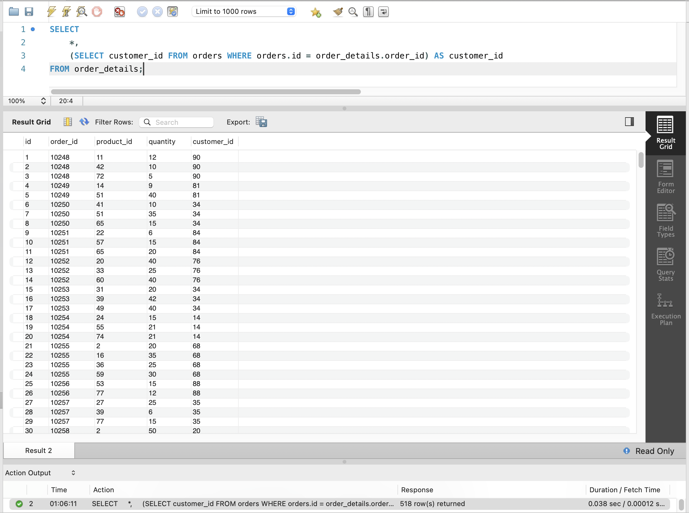
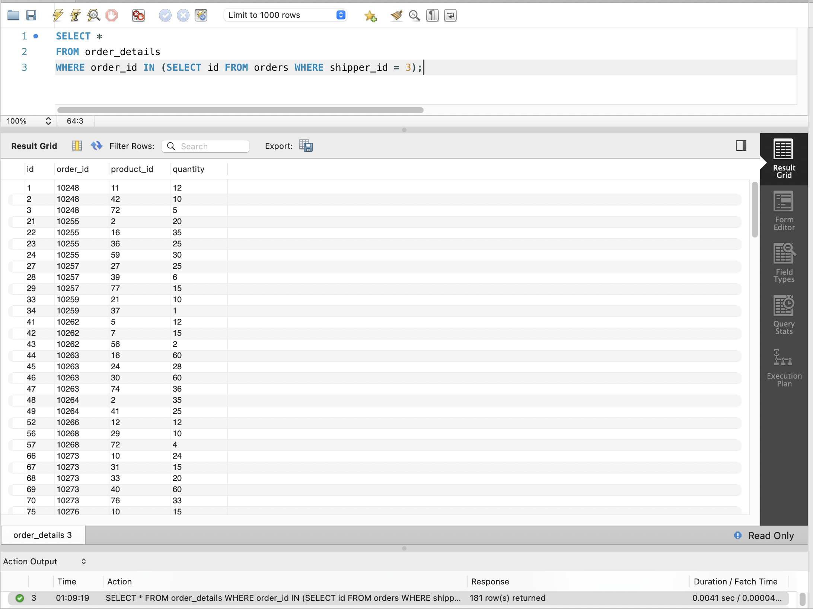
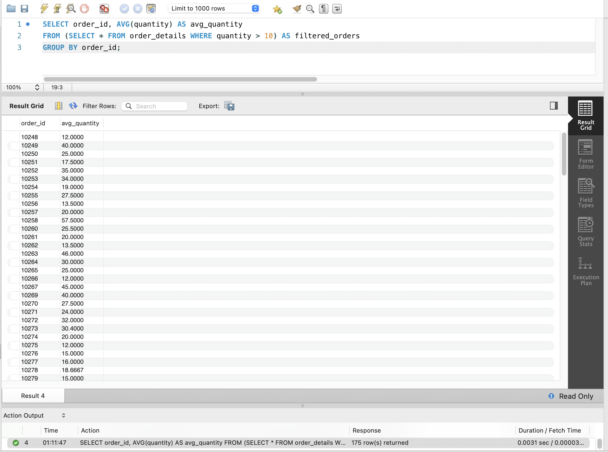
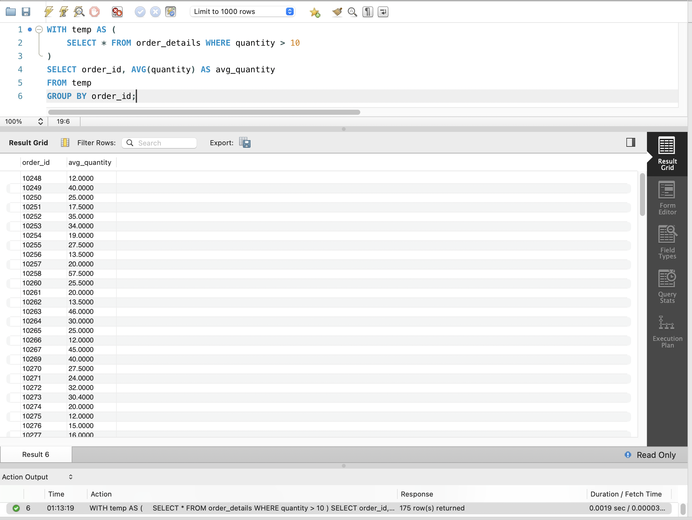
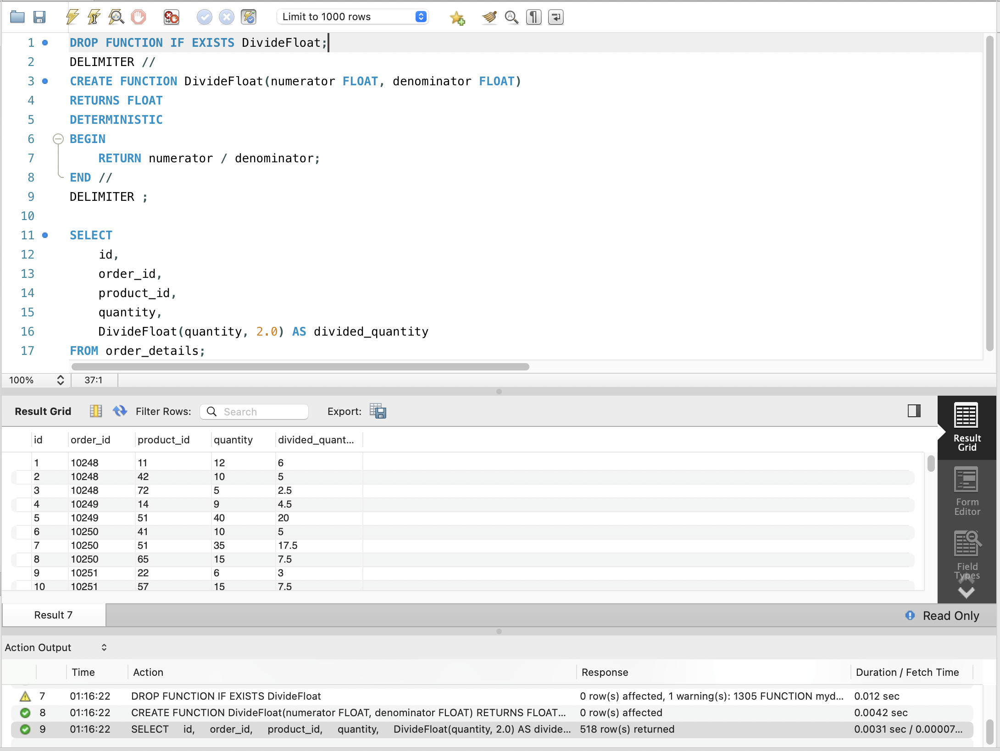

# GoIT RDB Homework 05

Цей репозиторій містить результати виконання домашнього завдання №5 з курсу Реляційних Баз Даних (GoIT).

## Завдання 1

Напишіть SQL запит, який буде відображати таблицю `order_details` та поле `customer_id` з таблиці `orders` відповідно для кожного поля запису з таблиці `order_details`. Це зроблено за допомогою вкладеного запиту в операторі `SELECT`.

```sql
SELECT
    *,
    (SELECT customer_id FROM orders WHERE orders.id = order_details.order_id) AS customer_id
FROM order_details;
```

**Скріншот результату:**


## Завдання 2

Напишіть SQL запит, який буде відображати таблицю `order_details`. Відфільтруйте результати так, щоб відповідний запис із таблиці `orders` виконував умову `shipper_id=3`. Це зроблено за допомогою вкладеного запиту в операторі `WHERE`.

```sql
SELECT *
FROM order_details
WHERE order_id IN (SELECT id FROM orders WHERE shipper_id = 3);
```

**Скріншот результату:**


## Завдання 3

Напишіть SQL запит, вкладений в операторі `FROM`, який буде обирати рядки з умовою `quantity>10` з таблиці `order_details`. Для отриманих даних знайдіть середнє значення поля `quantity` — групувати слід за `order_id`.

```sql
SELECT order_id, AVG(quantity) AS avg_quantity
FROM (SELECT * FROM order_details WHERE quantity > 10) AS filtered_orders
GROUP BY order_id;
```

**Скріншот результату:**


## Завдання 4

Розв’яжіть завдання 3, використовуючи оператор `WITH` для створення тимчасової таблиці `temp`.

```sql
WITH temp AS (
    SELECT * FROM order_details WHERE quantity > 10
)
SELECT order_id, AVG(quantity) AS avg_quantity
FROM temp
GROUP BY order_id;
```

**Скріншот результату:**


## Завдання 5

Створіть функцію з двома параметрами, яка буде ділити перший параметр на другий. Обидва параметри та значення, що повертається, повинні мати тип `FLOAT`. Використайте конструкцію `DROP FUNCTION IF EXISTS`. Застосуйте функцію до атрибута `quantity` таблиці `order_details`. Другим параметром може бути довільне число на ваш розсуд.

```sql
DROP FUNCTION IF EXISTS DivideFloat;

DELIMITER //

CREATE FUNCTION DivideFloat(numerator FLOAT, denominator FLOAT)
RETURNS FLOAT
DETERMINISTIC
BEGIN
    RETURN numerator / denominator;
END //

DELIMITER ;

SELECT
    id,
    order_id,
    product_id,
    quantity,
    DivideFloat(quantity, 2.0) AS divided_quantity
FROM order_details;
```

**Скріншот результату:**

